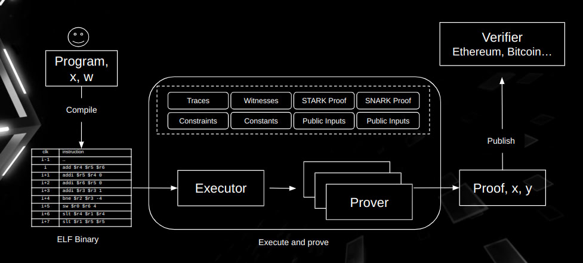

zkMIPS+ verifies the correctness of the execution of an MIPS program by generating a zero-knowledge proof that reflects the CPU states throughout the program’s runtime. In essence, the “computation problem” in zkMIPS+ is the given program, and its “solution” is the **execution trace** produced when running that program. This trace details every step of the program execution, with each row corresponding to a single step (or a cycle) and each column representing a fixed CPU variable or register state. Verifying a program essentially involves checking that every step in the trace aligns with the corresponding instruction and the expected logic of the MIPS program.

Below is the workflow of zkMIPS+.

## High-Level Workflow of zkMIPS+

Referring to the above diagram, zkMIPS+ follows a structured pipeline composed of the following stages:

1. **Program**  
   A developer writes code in a high-level language such as in Rust, creating the application logic that needs to be verified.

2. **MIPS Compiler**  
   The high-level program is compiled into an MIPS ELF binary using a dedicated compiler. This step converts the source code into MIPS32-compliant instructions to produce an executable ELF file.

3. **ELF Loader**  
   The ELF Loader reads and interprets the ELF file and prepares for execution within the MIPS VM. This includes loading code segments, initializing memory, and setting up the program’s entry point.

4. **MIPS VM**  
   The MIPS Virtual Machine simulates an MIPS CPU to run the loaded ELF file. It captures every step of execution—such as register states, memory accesses, and instruction addresses—and generates the **execution trace** (i.e., a detailed record of the entire computation).

5. **Execution Trace**  
   This trace is the core data structure used to verify the program. Each row represents a single step of execution, and each column corresponds to a particular CPU register or state variable. By ensuring that every step in the trace matches the intended behavior of the MIPS instructions, zkMIPS+ can prove the program was executed correctly.

6. **Prover**  
   The Prover takes the execution trace from the MIPS VM and generates a zero-knowledge proof. This proof shows that the program followed the correct sequence of states without revealing any sensitive internal data.  In addition, the proof is eventually used by a **Verifier Contract** or another verification component, often deployed on-chain, to confirm that the MIPS program executed as claimed.

## Prover Internal Proof Generation Steps

Within the Prover, zkMIPS+ employs multiple stages to efficiently process and prove the execution trace, ultimately producing a format suitable for on-chain verification:

1. **Segmentation**  
   The entire program trace is split into multiple segments. This segmentation reduces the data size per step and facilitates parallel and modular proof generation.

2. **Module Division**  
   Each segment is further broken down into modules—typically grouped into four tables: arithmetic, logic, memory, and control. By organizing instructions into specialized modules, the Prover can handle them more efficiently.

3. **STARK**  
   Each module undergoes an independent STARK proof using FRI (Fast Reed-Solomon Interactive Oracle Proofs of Proximity). These FRI-based proofs verify that the arithmetic, logic, memory, and control operations within each module conform to the correct rules.

4. **LogUp (STARK)**  
   Once all modules within a segment are proven, they are combined into a single proof per segment via the LogUp protocol (implemented with Starky). This step merges multiple STARK proofs into a cohesive segment-level proof.

5. **PLONK**  
   The segment proofs are then recursively aggregated into a **continuation proof** covering the entire program execution trace. This is done using PLONK-based techniques (such as Plonky) to ensure that the proofs for all segments link together to validate the full computation.

6. **Groth16**  
   Finally, to facilitate on-chain verification (for example, on the Ethereum Virtual Machine), the proof is transformed into a Groth16 proof. Groth16 is a SNARK system widely used for its efficient on-chain verification costs.
   
In conclusion, throughout this process, zkMIPS+ seamlessly transforms a high-level program into MIPS instructions, runs those instructions to produce an execution trace, and then applies STARK, LogUp, PLONK, and Groth16 techniques to generate a succinct zero-knowledge proof. This proof can be verified on-chain to ensure both the correctness and the privacy of the computation.
